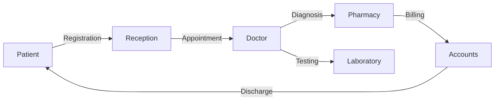

# 🏥 Advanced Hospital Management System

<div align="center">
  
  
  
  
</div>

---

## 📖 Overview
A professional, modern, and high-performance **Hospital Management System** designed to streamline medical workflows. This application provides a comprehensive suite of tools for managing patient records, appointment scheduling, staff coordination, and inventory management.



## ✨ Core Modules
- 📂 **Patient Management**: Securely store and retrieve electronic health records (EHR).
- 📅 **Smart Scheduling**: Efficient appointment booking and doctor availability tracking.
- 💊 **Pharmacy & Inventory**: Real-time tracking of medications and medical supplies.
- 💳 **Billing & Finance**: Integrated billing system with automated invoice generation.
- 📊 **Analytics Dashboard**: Visual insights into hospital performance and patient statistics.

## 🛠️ Tech Stack
- **Backend**: Python (Flask)
- **Frontend**: Modern HTML5, CSS3 (Custom Design System), JavaScript
- **Database**: SQLite/PostgreSQL
- **Aesthetics**: Optimized for high contrast, readability, and a premium feel.

## 🚀 Deployment

1. **Clone the repository**:
   ```bash
   git clone https://github.com/shoumikbalasomu/Hospital_Management_System.git
   cd Hospital_Management_System
   ```

2. **Setup Virtual Environment**:
   ```bash
   python -m venv venv
   source venv/bin/activate
   ```

3. **Install dependencies**:
   ```bash
   pip install -r requirements.txt
   ```

4. **Initialize & Run**:
   ```bash
   flask run
   ```

## 📜 License
Licensed under the [MIT License](LICENSE). Copyright © 2026 Shoumik Bala Somu.

---

<div align="center">
  <p>Revolutionizing Healthcare through Smart Technology. 🏥🚀</p>
  <p>Part of the Shoumik Family Collection</p>
</div>
